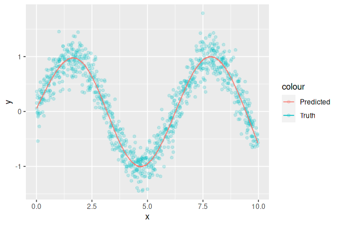

<!-- README.md is generated from README.Rmd. Please edit that file -->

# Distributed CWB prototype

## General design

  - Focus on simple base learner:
      - Splines
      - Categorial base learner via dummy coding and ridge penalty
      - Row wise Kronecker product
  - `R6` classes for sites and host to “simulate” communication.
      - Sites contains their data.
      - The host does not contain any data, but information about the
        structure of the base learners, the global CWB model, etc.
  - CWB is also a `R6` class as well as the base learners.

<!-- end list -->

``` r
library(R6)

source(here::here("R/baselearner.R"))
source(here::here("R/cwb.R"))
source(here::here("R/site.R"))
source(here::here("R/host.R"))

nsim = 1000L
x = runif(nsim, 0, 10)
svec = sample(LETTERS[1:4], nsim, TRUE)
dat = data.frame(x = x, y = sin(x))

# CWB structure:
bl_spline  = BaselearnerPSpline$new("x", ord = 2)
#bl_ridge   =
#bl_combine =

# Define base learner list
#bls = list(bl_spline, bl_combine)
bls = list(bl_spline)

# Local CWB:
loss  = function(y, y_pred) 0.5 * (y - y_pred)^2
dloss = function(y, y_pred) -(y - y_pred)

cwb = CWB$new("y", lr = 0.1, loss = loss, dloss = dloss)

# Define sites:
sites = lapply(unique(svec), function(s) {
  Site$new(s, dat[svec == s, ], cwb, bls) })

# Define the host:
host = Host$new(cwb, bls, sites)
```

## Initialization stage

Since initializing base learner often requires knowledge about the
pooled feature we have to consider: - Splines: - Min. and max.
calculation for the whole feature to calculate equal knots for all
sites. - **Shared data:** Min. and max. value. - Categorical - Ridge:
All groups of the categorical feature to build the 0-1-design matrix. -
**Shared data:** Groups at the site. - For both base learner: The
penalty depending on the degrees of freedom needs to be calculated on
the “global” \(X^TX\) matrix.

After calculating these properties and sharing them with all sites, we
can calculate the design matrices at each site required for modelling.

``` r
host$initializePrediction()
host$initializeBaselearner()
```

## Data at the host

In order to estimate the parameters, the penalty \(\lambda\) and penalty
matrix \(K_j\) per base learner \(j\) to conduct
\((F_j + \lambda_j K_j)^{-1}s\) with is kept at the host. Additionally,
\(F_j = X_j^TX_j\), which is also initialized once in the beginning, is
kept at the host. \[
F_j = \sum_{k=1}^K F_{k,j}, \qquad F_{k,j} = X_{k,j}^TX_{k,j}
\]

``` r
## Aggregated static parts:
str(host$init_aggr)
#> List of 1
#>  $ x_spline:List of 1
#>   ..$ knots: num [1:16, 1] -1.7993 -0.8923 0.0147 0.9217 1.8287 ...
str(host$bl_parts)
#> List of 1
#>  $ x_spline:List of 4
#>   ..$ XtX: num [1:13, 1:13] 5.206 11.31 0.758 0 0 ...
#>   ..$ K  : num [1:13, 1:13] 1 -2 1 0 0 0 0 0 0 0 ...
#>   ..$ df : num 4
#>   ..$ pen: num 571

host$offset
#> [1] 0.207
```

## Fitting stage

The fitting stage only requires the calculation of \(X_{k,j}^Tu\) with
pseudo residuals \(u\) in each iteration. For each site \(k\) and base
learner \(j\), \(X^T_{k,j} u_k\) is calculated and used to find the best
base learner. -\[
s_j = \sum_{k=1}^K s_{k,j}, \qquad s_k = X_{k,j}^Tu_k
\]

**Note:** Finding the best base learner requires multiple communication
steps: - Communicate \(X_{k,j}^T u_k\) - Send parameters
\(\hat{\theta}_j = F_j^{-1} u_j\) - Communicate sum of squared errors
\(\sum_k \| u_k - X_{k,j}\hat{\theta}_j\) - Update via sending best
parameter \(\hat{\theta}_{j^\ast}\), \(j^\ast = \argmin_j SSE_j\)

``` r
mstop = 1000L
trace = character()
for (m in seq_len(mstop)) {
  trace = c(trace, capture.output(host$updateCWB(m)))
}
cat(tail(trace), sep = "")
#> 995: 0.00003765996: 0.00003761997: 0.00003757998: 0.00003754999: 0.00003751000: 0.00003746
```

## Check the algorithm

### Estimated effect

The CWB object of the host contains the final model as base learner map
`$getBlMap()` while the whole trace of added base learner is accessible
via `getBlTrace()`:

``` r
str(host$cwb$getBlTrace()[1:3])
#> List of 3
#>  $ :List of 2
#>   ..$ name : chr "x_spline"
#>   ..$ param: num [1:13, 1] 0.7054 0.5249 0.3277 0.0715 -0.2143 ...
#>  $ :List of 2
#>   ..$ name : chr "x_spline"
#>   ..$ param: num [1:13, 1] 0.6362 0.4783 0.3037 0.0688 -0.199 ...
#>  $ :List of 2
#>   ..$ name : chr "x_spline"
#>   ..$ param: num [1:13, 1] 0.5729 0.4357 0.2817 0.0664 -0.1848 ...
str(host$cwb$getBlMap())
#> List of 1
#>  $ x_spline: num [1:13, 1] -0.59 0.267 0.876 0.645 -0.26 ...
```

Visualizing the estimated effect reveals an accurate effect estimation:

``` r
## Copy everything:
blst = bls
d0 = dat

lapply(blst, function(bl) bl$initDesign(d0, host$init_aggr$x_spline$knots))
#> [[1]]
#> [1] TRUE
d0$pred = host$offset + blst[[1]]$linPred(host$cwb$getBlMap()[["x_spline"]])

library(ggplot2)

ggplot(d0) +
  geom_point(aes(x = x, y = y, color = "Truth")) +
  geom_line(aes(x = x, y = pred, color = "Predicted"))
```



### Comparison with compboost

A comparison with compboost also shows the correctness of the
distributed algorithm:

``` r
## Compare to compboost:
devtools::load_all("~/repos/compboost")
cboost = boostSplines(data = dat, target = "y", loss = LossQuadratic$new(),
  learning_rate = 0.1, iterations = 1000L, n_knots = 10, df = 4, degree = 2,
  differences = 2)
#>    1/1000   risk = 0.21  time = 0   
#>   25/1000   risk = 0.081  time = 1337   
#>   50/1000   risk = 0.041  time = 2644   
#>   75/1000   risk = 0.022  time = 3960   
#>  100/1000   risk = 0.011  time = 5293   
#>  125/1000   risk = 0.006  time = 6632   
#>  150/1000   risk = 0.0033  time = 8005   
#>  175/1000   risk = 0.0018  time = 9383   
#>  200/1000   risk = 0.0011  time = 10772   
#>  225/1000   risk = 0.00065  time = 12209   
#>  250/1000   risk = 0.00042  time = 13634   
#>  275/1000   risk = 0.00029  time = 15088   
#>  300/1000   risk = 0.00022  time = 16570   
#>  325/1000   risk = 0.00017  time = 18072   
#>  350/1000   risk = 0.00015  time = 19584   
#>  375/1000   risk = 0.00013  time = 21119   
#>  400/1000   risk = 0.00011  time = 22666   
#>  425/1000   risk = 0.0001  time = 24225   
#>  450/1000   risk = 9.3e-05  time = 25802   
#>  475/1000   risk = 8.6e-05  time = 27387   
#>  500/1000   risk = 8e-05  time = 28988   
#>  525/1000   risk = 7.6e-05  time = 30580   
#>  550/1000   risk = 7.1e-05  time = 32172   
#>  575/1000   risk = 6.8e-05  time = 33776   
#>  600/1000   risk = 6.4e-05  time = 35399   
#>  625/1000   risk = 6.1e-05  time = 37033   
#>  650/1000   risk = 5.9e-05  time = 38686   
#>  675/1000   risk = 5.6e-05  time = 40352   
#>  700/1000   risk = 5.4e-05  time = 42036   
#>  725/1000   risk = 5.2e-05  time = 43735   
#>  750/1000   risk = 5e-05  time = 45455   
#>  775/1000   risk = 4.9e-05  time = 47187   
#>  800/1000   risk = 4.7e-05  time = 48935   
#>  825/1000   risk = 4.5e-05  time = 50733   
#>  850/1000   risk = 4.4e-05  time = 52520   
#>  875/1000   risk = 4.3e-05  time = 54323   
#>  900/1000   risk = 4.2e-05  time = 56143   
#>  925/1000   risk = 4e-05  time = 57983   
#>  950/1000   risk = 3.9e-05  time = 59843   
#>  975/1000   risk = 3.8e-05  time = 61729   
#> 1000/1000   risk = 3.7e-05  time = 63637   
#> 
#> 
#> Train 1000 iterations in 0 Seconds.
#> Final risk based on the train set: 3.7e-05

all.equal(cboost$baselearner_list$x_spline$factory$getPenaltyMat(),
  host$bl_parts$x_spline$K)
#> [1] TRUE

all.equal(cboost$baselearner_list$x_spline$factory$getPenalty(),
  host$bl_parts$x_spline$pen)
#> [1] TRUE

all.equal(check.attributes = FALSE,
  cboost$baselearner_list$x_spline$factory$getData() %*%
    t(cboost$baselearner_list$x_spline$factory$getData()),
  host$bl_parts$x_spline$XtX)
#> [1] TRUE

cf_cboost = cboost$getEstimatedCoef()
cf_dist   = host$cwb$getBlMap()

all.equal(cf_cboost$offset, host$offset)
#> [1] TRUE
all.equal(cf_cboost$x_spline, cf_dist$x_spline, check.attributes = FALSE)
#> [1] TRUE
all.equal(cboost$model$getRiskVector()[-1], host$risk)
#> [1] TRUE
```
