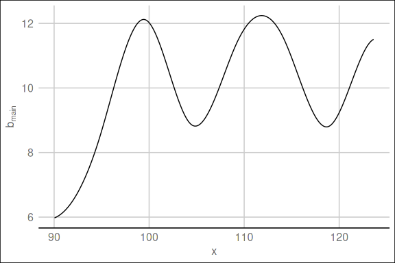
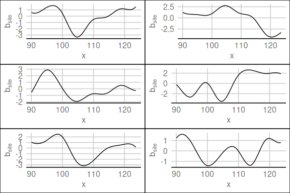

<!-- README.md is generated from README.Rmd. Please edit that file -->

# Feature site effects

## Simulate data

### Main effect

The main effect \(b_{\text{main}}\) is simulated as spline:

### Site effect

Additionally, for each of the \(K = 6\) sites a site effect
\(b_{\text{site},k}\) is also simulated as a spline with a sum to zero
constraint (is this a realistic assumption for our case???).

### Data for modelling

The data used for modelling contains the `x`, `y`, and the `site`
(denoted as \(s\)). The target variable `y` is simulated using the main
effect and adding the site effect for the corresponding site: \[
y^{(i)} = b_{\text{main}}(x^{(i)}) + \sum_{k=1}^K \delta_{k}(s^{(i)}) b_{\text{site},k}(x^{(i)})
\]

|     y |     x | site |   ynn |
| ----: | ----: | ---: | ----: |
| 7.199 | 90.04 |    2 | 8.619 |
| 7.198 | 90.05 |    2 | 7.432 |
| 5.448 | 90.05 |    3 | 6.056 |
| 5.748 | 90.05 |    4 | 5.217 |
| 7.196 | 90.06 |    2 | 7.691 |
| 7.195 | 90.06 |    2 | 5.809 |
| 6.575 | 90.06 |    1 | 6.426 |
| 5.463 | 90.07 |    3 | 5.173 |
| 5.739 | 90.07 |    4 | 6.579 |
| 7.192 | 90.07 |    2 | 7.076 |

## Define model

The base learner added to the model is first a P-spline with \(df = 5\)
and 20 knots. Then, a tensor product multiplying the spline base with a
dummy coded design matrix with a ridge penalty for the site is added.
The degrees of freedom of the ridge base learner is 1.

    #>     1/10000   risk = 2.7  oob = 2.6   
    #>   500/10000   risk = 1.1  oob = 0.96   
    #>  1000/10000   risk = 0.77  oob = 0.66   
    #>  1500/10000   risk = 0.56  oob = 0.45   
    #>  2000/10000   risk = 0.42  oob = 0.31   
    #>  2500/10000   risk = 0.33  oob = 0.22   
    #>  3000/10000   risk = 0.26  oob = 0.15   
    #>  3500/10000   risk = 0.22  oob = 0.11   
    #>  4000/10000   risk = 0.19  oob = 0.078   
    #>  4500/10000   risk = 0.16  oob = 0.057   
    #>  5000/10000   risk = 0.15  oob = 0.042   
    #>  5500/10000   risk = 0.14  oob = 0.032   
    #>  6000/10000   risk = 0.13  oob = 0.025   
    #>  6500/10000   risk = 0.13  oob = 0.019   
    #>  7000/10000   risk = 0.12  oob = 0.015   
    #>  7500/10000   risk = 0.12  oob = 0.012   
    #>  8000/10000   risk = 0.12  oob = 0.01   
    #>  8500/10000   risk = 0.12  oob = 0.0087   
    #>  9000/10000   risk = 0.11  oob = 0.0074   
    #>  9500/10000   risk = 0.11  oob = 0.0065   
    #> 10000/10000   risk = 0.11  oob = 0.0057   
    #> 
    #> 
    #> Train 10000 iterations in 30 Seconds.
    #> Final risk based on the train set: 0.11

### Risk and selected base learner

### Prediction for main and site effects

## Overall prediction

